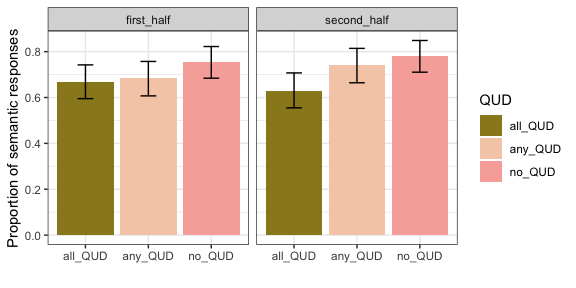

Experiment 1: some
================

### Before Exclusions

**Number of participants tested:**

    ## [1] 150

**Participants in each condition:**

    ## 
    ## all_QUD any_QUD  no_QUD 
    ##      50      50      50

### Exclusions

**Non-unique participants (remove all attempts):**

    ## integer(0)

**Participants whose native language is not english:**

    ## [1] workerid language
    ## <0 rows> (or 0-length row.names)

**Participants who got at least two practice trials wrong:**

    ## 
    ##  2  3  4 
    ## 24  2  6

**Participants who got the audio check wrong more than one once:**

    ## < table of extent 0 >

**Participants who got the second comprehension question wrong more than twice:**

    ## # A tibble: 0 x 2
    ## # Groups:   workerid [0]
    ## # … with 2 variables: workerid <int>, n <int>

**Participants with accuracy of lower than 85% on non-critical trials:**

    ## # A tibble: 4 x 4
    ## # Groups:   workerid, gaveRightAnswer [4]
    ##   workerid gaveRightAnswer     n accuracy
    ##      <int> <chr>           <int>    <dbl>
    ## 1       32 1                   3     4.69
    ## 2       65 1                  32    50   
    ## 3      105 1                  38    59.4 
    ## 4      115 1                  40    62.5

#### Additional Exclusions

**Participants who gave more than 5 very slow (logRT&gt;20) responses:**

    ## # A tibble: 0 x 3
    ## # Groups:   workerid [0]
    ## # … with 3 variables: workerid <int>, slowResponse <lgl>, n <int>

**Responses that are faster than the onser of the quantifier (rawRT&lt;600):**

    ## [1] 5

**Responses that are very slow (logRT&gt;20):**

    ## [1] 3

After Exclusions
----------------

**Number of participants:**

    ## [1] 114

**Participants left in each condition:**

    ## 
    ## all_QUD any_QUD  no_QUD 
    ##      41      35      38

General
-------

**Expected number of yes and no answers:**

    ## 
    ##   No  Yes 
    ## 3658 3894

**Accuracy**

**Accuracy and trial order**

**Distribution of RT and logRT**

    ## Warning: Removed 39 rows containing non-finite values (stat_bin).

    ## Warning: Removed 2 rows containing missing values (geom_bar).

 15 fastest responses (raw RT)

    ##  [1] 619 661 673 673 705 707 714 721 724 730 731 732 732 733 738

15 slowest responses (raw RT)

    ##  [1] 16194 16625 16677 17431 17618 18739 19313 19596 21854 22356 22990
    ## [12] 27169 28759 29000 61505

### Non-critical Trials

**Response type:**

**Response time:**

### Critical Trials

**Total number of critical trials (8 per participant):**

    ## [1] 911

#### Response Type

**Distribution of participants over number of semantic responses**

    ##          
    ##            0  1  2  3  4  5  6  7  8
    ##   all_QUD  8  4  1  0  3  0  1  4 20
    ##   any_QUD  5  0  2  1  3  2  0  5 17
    ##   no_QUD   6  1  1  0  0  0  1  7 22

**Response type and trial order**

**Age distribution of participants**

**Response type and age**

#### Response Time

**Distribution of response times in critical trials**

    ## Warning: Removed 11 rows containing non-finite values (stat_bin).

    ## Warning: Removed 2 rows containing missing values (geom_bar).

**Response time and QUD**

**Response time, trial order and QUD**

**Response time, responder type and QUD**

**Response time, age and QUD**

**Response time, age, responder type and QUD**

