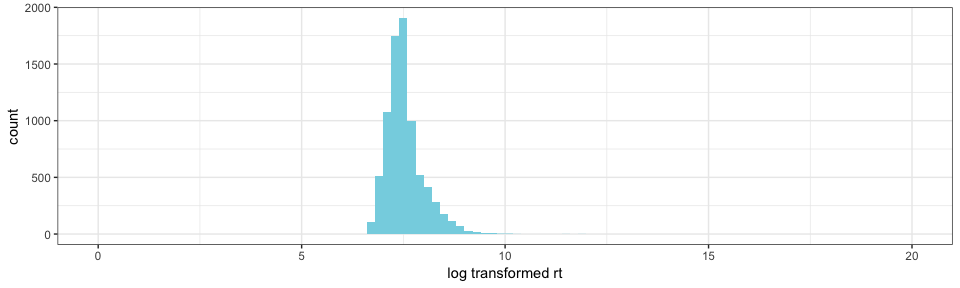

Experiment 2: summa
================

### Before Exclusions

**Number of participants tested:**

    ## [1] 150

**Participants in each condition:**

    ## 
    ## all_QUD any_QUD  no_QUD 
    ##      50      50      50

### Exclusions

**Non-unique participants (remove all attempts):**

    ## [1] 114 115

**Participants whose native language is not english:**

    ##   workerid   language
    ## 1       70           
    ## 2      109 Vietnamese
    ## 3      131    Spanish

**Participants who got at least two practice trials wrong:**

    ## 
    ##  2  3  4 
    ## 17  2  5

**Participants who got the audio check wrong more than one once:**

    ## < table of extent 0 >

**Participants who got the second comprehension question wrong more than twice:**

    ## # A tibble: 1 x 2
    ## # Groups:   workerid [1]
    ##   workerid     n
    ##      <int> <int>
    ## 1       56     3

**Participants with accuracy of lower than 85% on non-critical trials:**

    ## # A tibble: 7 x 4
    ## # Groups:   workerid, gaveRightAnswer [7]
    ##   workerid gaveRightAnswer     n accuracy
    ##      <int> <chr>           <int>    <dbl>
    ## 1       25 1                  51     79.7
    ## 2       50 1                  31     48.4
    ## 3       71 1                  54     84.4
    ## 4       72 1                  54     84.4
    ## 5       98 1                  41     64.1
    ## 6      113 1                  53     82.8
    ## 7      132 1                  36     56.2

#### Additional Exclusions

**Participants who gave more than 5 very slow (logRT&gt;20) responses:**

    ## # A tibble: 0 x 3
    ## # Groups:   workerid [0]
    ## # … with 3 variables: workerid <int>, slowResponse <lgl>, n <int>

**Responses that are faster than the onser of the quantifier (rawRT&lt;600):**

    ## [1] 2

**Responses that are very slow (logRT&gt;20):**

    ## [1] 1

After Exclusions
----------------

**Number of participants:**

    ## [1] 111

**Participants left in each condition:**

    ## 
    ## all_QUD any_QUD  no_QUD 
    ##      37      36      38

General
-------

**Expected number of yes and no answers:**

    ## 
    ##   No  Yes 
    ## 3776 3776

**Accuracy**

**Accuracy and trial order**

**Distribution of RT and logRT**

    ## Warning: Removed 41 rows containing non-finite values (stat_bin).

    ## Warning: Removed 2 rows containing missing values (geom_bar).

 15 fastest responses (raw RT)

    ##  [1] 749 761 762 762 767 772 773 777 777 786 787 797 797 798 801

15 slowest responses (raw RT)

    ##  [1]  15259  16679  17576  17941  18571  20420  21136  21460  22898  24191
    ## [11]  26063  26384  28856 107992 161349

### Non-critical Trials

**Response type:**

**Response time:**

### Critical Trials

**Total number of critical trials (8 per participant):**

    ## [1] 888

#### Response Type

**Distribution of participants over number of semantic responses**

    ##          
    ##            0  1  2  3  5  6  7  8
    ##   all_QUD 24  3  3  0  0  0  2  5
    ##   any_QUD 21  2  1  1  1  1  2  7
    ##   no_QUD  20  2  2  0  1  1  2 10

**Response type and trial order**

**Age distribution of participants**

**Response type and age**

#### Response Time

**Distribution of response times in critical trials**

    ## Warning: Removed 6 rows containing non-finite values (stat_bin).

    ## Warning: Removed 2 rows containing missing values (geom_bar).

**Response time and QUD**

**Response time, trial order and QUD**

**Response time, responder type and QUD**

**Response time, age and QUD**

**Response time, age, responder type and QUD**

