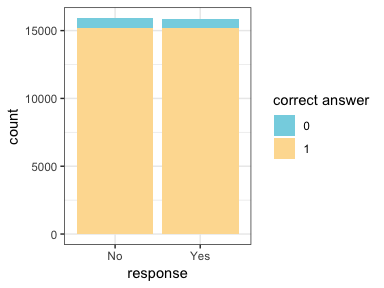
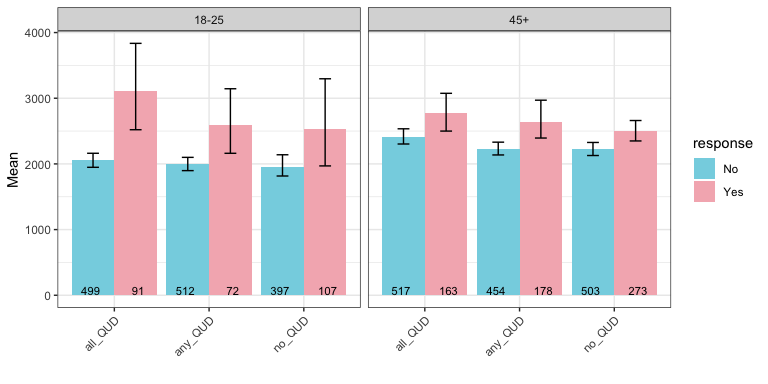

Experiment 3: summa + age groups
================

### Before Exclusions

**Number of participants tested:**

    ## [1] 536

**Participants in each condition:**

    ##        
    ##         all_QUD any_QUD no_QUD
    ##   18-25      81      83     72
    ##   45+       100     100    100

### Exclusions

**Non-unique participants (remove all attempts):**

    ## [1] 230 230

**Age doesn't match age given in prescreening or left blank:**

    ##   workerid age age_group    qud correct_group
    ## 1      101  34     18-25 anyQUD             0
    ## 2      109  NA     18-25 anyQUD          <NA>
    ## 3      110  27     18-25 anyQUD             0
    ## 4      181  NA     18-25  noQUD          <NA>
    ## 5      205  NA     18-25  noQUD          <NA>
    ## 6      300  NA       45+ allQUD          <NA>
    ## 7      393  NA       45+ anyQUD          <NA>

**Participants whose native language is not english:**

*Because we prescreened participants for this experiment, people who left it blank will not be excluded this time*

    ##    workerid  language
    ## 1        28          
    ## 2        77 Bulgarian
    ## 3       109          
    ## 4       128 cantonese
    ## 5       152          
    ## 6       163   Spanish
    ## 7       172   Spanish
    ## 8       205          
    ## 9       241          
    ## 10      300          
    ## 11      365          
    ## 12      393          
    ## 13      533  Mandarin

**Participants who got at least three practice trials wrong:**

    ## 
    ##  3  4 
    ## 10 13

**Participants who got the audio check wrong more than one once:**

    ## 
    ## 366 
    ##   1

**Participants who got the second comprehension question wrong more than twice:**

    ## # A tibble: 0 x 2
    ## # Groups:   workerid [0]
    ## # … with 2 variables: workerid <int>, n <int>

**Participants with accuracy of lower than 85% on non-critical trials:**

    ## # A tibble: 26 x 4
    ## # Groups:   workerid, gaveRightAnswer [26]
    ##    workerid gaveRightAnswer     n accuracy
    ##       <int> <chr>           <int>    <dbl>
    ##  1       19 1                  36    56.2 
    ##  2       26 1                  35    54.7 
    ##  3       76 1                  32    50   
    ##  4      129 1                  33    51.6 
    ##  5      153 1                  33    51.6 
    ##  6      157 1                  33    51.6 
    ##  7      168 1                   5     7.81
    ##  8      195 1                  34    53.1 
    ##  9      259 1                  32    50   
    ## 10      280 1                  53    82.8 
    ## # … with 16 more rows

#### Additional Exclusions

**Participants who gave more than 5 very slow (logRT&gt;20) responses:**

    ## # A tibble: 0 x 3
    ## # Groups:   workerid [0]
    ## # … with 3 variables: workerid <int>, slowResponse <lgl>, n <int>

**Responses that are faster than the onser of the quantifier (rawRT&lt;600):**

    ## [1] 10

**Responses that are very slow (logRT&gt;20):**

    ## [1] 4

After Exclusions
----------------

**Number of participants:**

    ## [1] 471

**Participants left in each condition:**

    ## 
    ## all_QUD any_QUD  no_QUD 
    ##     159     152     160

General
-------

**Expected number of yes and no answers:**

    ## 
    ##    No   Yes 
    ## 15904 15904

**Accuracy**

**Accuracy and trial order**

**Distribution of RT and logRT**

    ## Warning: Removed 170 rows containing non-finite values (stat_bin).

    ## Warning: Removed 2 rows containing missing values (geom_bar).

 15 fastest responses (raw RT)

    ##  [1] 650 663 667 689 711 711 712 715 731 738 739 740 743 745 750

15 slowest responses (raw RT)

    ##  [1]  30163  32167  33178  34888  35881  36507  39002  39438  40253  71041
    ## [11]  71813  78323  81411  91796 854982

### Non-critical Trials

**Response type:**

**Response time:**

### Critical Trials

**Total number of critical trials (8 per participant):**

    ## [1] 3766

#### Response Type

**Distribution of participants over number of semantic responses**

    ##          
    ##             0   1   2   3   4   5   6   7   8
    ##   all_QUD  15   7   2   3   5   3   7  17 100
    ##   any_QUD  17   4   2   3   5   4   2  23  92
    ##   no_QUD   33   7   0   3   2   6   5  16  88

**Response type and trial order**

**Age distribution of participants**

**Response type and age**

#### Response Time

**Distribution of response times in critical trials**

    ## Warning: Removed 23 rows containing non-finite values (stat_bin).

    ## Warning: Removed 2 rows containing missing values (geom_bar).

**Response time and QUD**

**Response time, trial order and QUD**

**Response time, responder type and QUD**

**Response time, age and QUD**

**Response time, age, responder type and QUD**

**Models**
