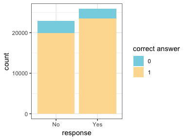
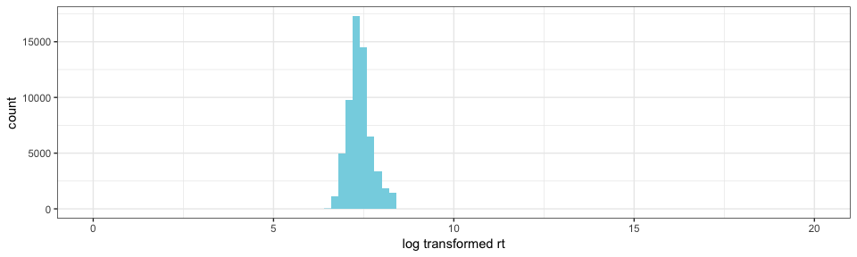
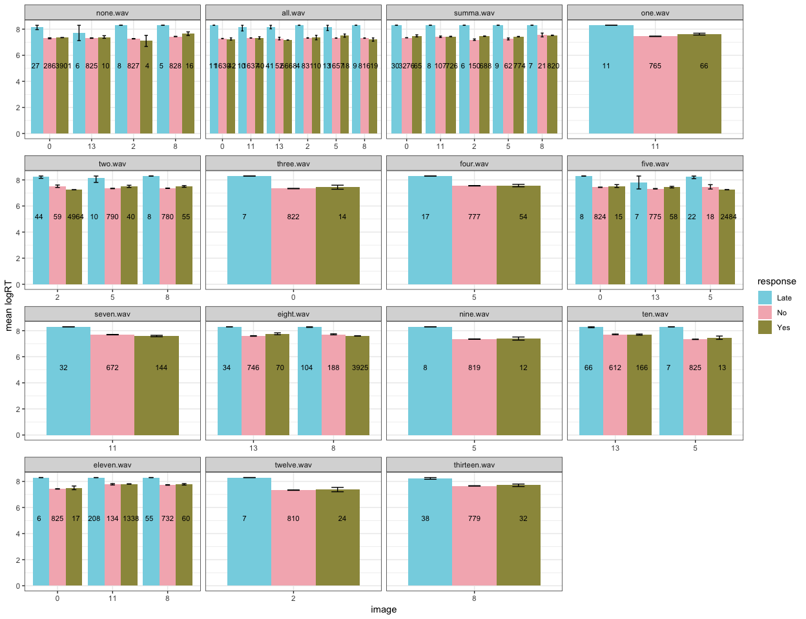
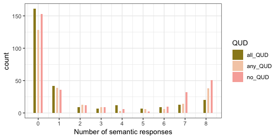
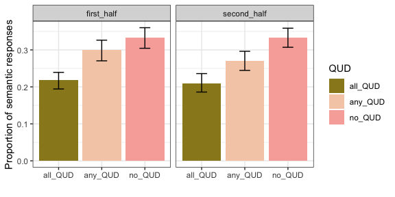
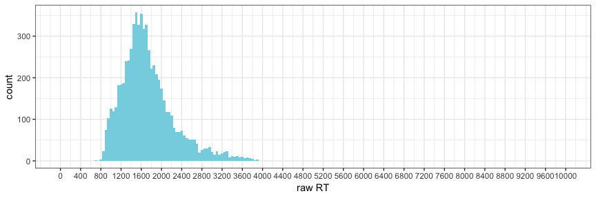

Experiment 4: summa with time pressure
================

### Before Exclusions

**Number of participants tested:**

    ## [1] 1200

**Participants in each condition:**

    ## 
    ## all_QUD any_QUD  no_QUD 
    ##     400     400     400

### Exclusions

**Non-unique participants (remove all attempts):**

    ## integer(0)

**Participants whose native language is not english:**

    ##    workerid  language
    ## 1        17        29
    ## 2        37 Cantonese
    ## 3        82 Hungarian
    ## 4        84          
    ## 5       119   swahili
    ## 6       151   Spanish
    ## 7       220   Chinese
    ## 8       245   Spanish
    ## 9       390      Urdu
    ## 10      402  Filipino
    ## 11      420          
    ## 12      430   Spanish
    ## 13      461   Russian
    ## 14      494   finnish
    ## 15      505   spanish
    ## 16      546          
    ## 17      581   Spanish
    ## 18      590          
    ## 19      602          
    ## 20      672  Mandarin
    ## 21      691          
    ## 22      695  romanian
    ## 23      715          
    ## 24      776   Spansih
    ## 25      780   tagalog
    ## 26      793    Polish
    ## 27      860 bachelors
    ## 28      870    German
    ## 29      910          
    ## 30      911          
    ## 31      924   Spanish
    ## 32      971          
    ## 33     1086   chinese
    ## 34     1160          
    ## 35     1180          
    ## 36     1182    Arabic
    ## 37     1187

**Participants who got at least three practice trials wrong:**

    ## 
    ##  3  4 
    ## 58 35

**Participants who got the audio check wrong more than one once:**

    ## 
    ## 187 601 696 816 953 
    ##   1   1   1   1   1

**Participants who got the second comprehension question wrong more than twice:**

    ## # A tibble: 15 x 2
    ## # Groups:   workerid [15]
    ##    workerid     n
    ##       <int> <int>
    ##  1       59     3
    ##  2      185     4
    ##  3      213     3
    ##  4      401     4
    ##  5      432     7
    ##  6      457     3
    ##  7      604     3
    ##  8      659     3
    ##  9      668     3
    ## 10      694     5
    ## 11      714     3
    ## 12      741     3
    ## 13      753     3
    ## 14      755     4
    ## 15      791     3

**Participants with accuracy of lower than 85% on non-critical trials with "some","none","all" and numbers below 6:**

    ##     workerid gaveRightAnswer  n answerNm  accuracy
    ## 1         15               1 14       38 36.842105
    ## 2         19               1 21       39 53.846154
    ## 3         24               1 38       46 82.608696
    ## 4         29               1  6       48 12.500000
    ## 5         31               1 35       46 76.086957
    ## 6         43               1 24       48 50.000000
    ## 7         47               1 19       46 41.304348
    ## 8         51               1 21       43 48.837209
    ## 9         61               1 26       48 54.166667
    ## 10        73               1  2       48  4.166667
    ## 11        77               1 37       48 77.083333
    ## 12        85               1 28       47 59.574468
    ## 13        87               1 19       41 46.341463
    ## 14        88               1 21       45 46.666667
    ## 15        91               1 22       48 45.833333
    ## 16        95               1 37       48 77.083333
    ## 17       121               1 21       40 52.500000
    ## 18       128               1 37       45 82.222222
    ## 19       138               1 14       34 41.176471
    ## 20       143               1 35       45 77.777778
    ## 21       152               1 29       46 63.043478
    ## 22       155               1  2       47  4.255319
    ## 23       157               1 18       41 43.902439
    ## 24       160               1 17       41 41.463415
    ## 25       161               1 18       41 43.902439
    ## 26       162               1 25       45 55.555556
    ## 27       188               1 22       48 45.833333
    ## 28       197               1 13       24 54.166667
    ## 29       214               1 26       47 55.319149
    ## 30       215               1 29       42 69.047619
    ## 31       233               1 27       48 56.250000
    ## 32       235               1 20       48 41.666667
    ## 33       236               1 21       44 47.727273
    ## 34       238               1 26       41 63.414634
    ## 35       247               1 24       48 50.000000
    ## 36       254               1 20       40 50.000000
    ## 37       258               1 29       48 60.416667
    ## 38       259               1 27       45 60.000000
    ## 39       263               1 40       48 83.333333
    ## 40       276               1  6       20 30.000000
    ## 41       282               1 25       47 53.191489
    ## 42       288               1 21       47 44.680851
    ## 43       293               1 20       46 43.478261
    ## 44       295               1 26       45 57.777778
    ## 45       296               1 27       48 56.250000
    ## 46       302               1 25       43 58.139535
    ## 47       303               1 21       39 53.846154
    ## 48       305               1 36       48 75.000000
    ## 49       306               1 23       43 53.488372
    ## 50       311               1 17       36 47.222222
    ## 51       316               1 23       42 54.761905
    ## 52       320               1 25       42 59.523810
    ## 53       322               1 23       46 50.000000
    ## 54       323               1 24       36 66.666667
    ## 55       325               1 24       48 50.000000
    ## 56       326               1 26       43 60.465116
    ## 57       329               1 26       48 54.166667
    ## 58       331               1 11       20 55.000000
    ## 59       342               1 17       40 42.500000
    ## 60       344               1 16       36 44.444444
    ## 61       351               1 20       44 45.454545
    ## 62       352               1 23       38 60.526316
    ## 63       357               1 22       47 46.808511
    ## 64       358               1 38       48 79.166667
    ## 65       361               1 24       43 55.813953
    ## 66       365               1 26       47 55.319149
    ## 67       366               1 19       38 50.000000
    ## 68       369               1 26       46 56.521739
    ## 69       370               1 20       48 41.666667
    ## 70       373               1 24       47 51.063830
    ## 71       378               1 27       45 60.000000
    ## 72       382               1  2       48  4.166667
    ## 73       385               1 21       41 51.219512
    ## 74       386               1 15       40 37.500000
    ## 75       392               1 37       45 82.222222
    ## 76       406               1 34       45 75.555556
    ## 77       410               1 18       46 39.130435
    ## 78       411               1 26       43 60.465116
    ## 79       415               1 25       46 54.347826
    ## 80       416               1 19       45 42.222222
    ## 81       425               1 19       41 46.341463
    ## 82       426               1 24       46 52.173913
    ## 83       439               1 26       45 57.777778
    ## 84       444               1 21       48 43.750000
    ## 85       471               1 34       45 75.555556
    ## 86       473               1 34       43 79.069767
    ## 87       482               1 17       46 36.956522
    ## 88       488               1 19       45 42.222222
    ## 89       501               1  1       47  2.127660
    ## 90       504               1 30       46 65.217391
    ## 91       506               1 24       44 54.545455
    ## 92       521               1 24       48 50.000000
    ## 93       523               1 20       40 50.000000
    ## 94       531               1 17       41 41.463415
    ## 95       533               1  9       14 64.285714
    ## 96       544               1 38       47 80.851064
    ## 97       547               1 39       47 82.978723
    ## 98       552               1 20       47 42.553191
    ## 99       555               1 17       38 44.736842
    ## 100      560               1  6       15 40.000000
    ## 101      564               1  2       46  4.347826
    ## 102      572               1 17       41 41.463415
    ## 103      584               1 23       44 52.272727
    ## 104      586               1 20       35 57.142857
    ## 105      588               1 20       42 47.619048
    ## 106      616               1 23       47 48.936170
    ## 107      618               1 10       44 22.727273
    ## 108      629               1 36       48 75.000000
    ## 109      631               1  4       48  8.333333
    ## 110      636               1 38       48 79.166667
    ## 111      644               1 15       37 40.540541
    ## 112      650               1 23       41 56.097561
    ## 113      657               1 23       39 58.974359
    ## 114      661               1 24       40 60.000000
    ## 115      663               1 28       46 60.869565
    ## 116      667               1 19       38 50.000000
    ## 117      669               1 23       45 51.111111
    ## 118      675               1 12       26 46.153846
    ## 119      682               1 27       46 58.695652
    ## 120      692               1 30       46 65.217391
    ## 121      704               1  5       47 10.638298
    ## 122      706               1  3       46  6.521739
    ## 123      716               1 22       46 47.826087
    ## 124      722               1 15       44 34.090909
    ## 125      723               1 23       47 48.936170
    ## 126      724               1  4       48  8.333333
    ## 127      726               1 25       48 52.083333
    ## 128      733               1 19       39 48.717949
    ## 129      737               1 27       45 60.000000
    ## 130      742               1 17       45 37.777778
    ## 131      748               1 21       42 50.000000
    ## 132      756               1 28       48 58.333333
    ## 133      764               1 19       44 43.181818
    ## 134      767               1 21       37 56.756757
    ## 135      770               1  7       48 14.583333
    ## 136      772               1 23       47 48.936170
    ## 137      773               1 19       41 46.341463
    ## 138      774               1 17       47 36.170213
    ## 139      781               1 22       33 66.666667
    ## 140      790               1 22       45 48.888889
    ## 141      796               1 19       46 41.304348
    ## 142      805               1 21       44 47.727273
    ## 143      808               1 19       48 39.583333
    ## 144      815               1 23       46 50.000000
    ## 145      822               1  2        6 33.333333
    ## 146      824               1 23       40 57.500000
    ## 147      825               1 39       47 82.978723
    ## 148      829               1 19       42 45.238095
    ## 149      832               1 22       48 45.833333
    ## 150      836               1 36       45 80.000000
    ## 151      842               1 17       42 40.476190
    ## 152      843               1 24       43 55.813953
    ## 153      846               1 22       41 53.658537
    ## 154      848               1 25       44 56.818182
    ## 155      850               1 20       36 55.555556
    ## 156      853               1 34       41 82.926829
    ## 157      857               1  7       17 41.176471
    ## 158      858               1 23       45 51.111111
    ## 159      865               1 24       44 54.545455
    ## 160      869               1  2        4 50.000000
    ## 161      878               1 33       40 82.500000
    ## 162      880               1 22       44 50.000000
    ## 163      888               1 26       42 61.904762
    ## 164      889               1 25       46 54.347826
    ## 165      902               1 23       39 58.974359
    ## 166      903               1 18       43 41.860465
    ## 167      907               1 34       45 75.555556
    ## 168      914               1 24       45 53.333333
    ## 169      920               1 32       42 76.190476
    ## 170      941               1 20       47 42.553191
    ## 171      943               1 15       28 53.571429
    ## 172      949               1 27       47 57.446809
    ## 173      956               1 22       44 50.000000
    ## 174      964               1 17       40 42.500000
    ## 175      966               1 26       47 55.319149
    ## 176      981               1 39       47 82.978723
    ## 177      983               1 19       41 46.341463
    ## 178     1006               1 25       40 62.500000
    ## 179     1010               1 17       43 39.534884
    ## 180     1013               1 33       46 71.739130
    ## 181     1015               1 39       46 84.782609
    ## 182     1019               1 18       47 38.297872
    ## 183     1040               1 21       43 48.837209
    ## 184     1071               1 23       44 52.272727
    ## 185     1075               1 23       35 65.714286
    ## 186     1085               1 18       39 46.153846
    ## 187     1097               1 22       41 53.658537
    ## 188     1099               1 20       38 52.631579
    ## 189     1101               1 16       38 42.105263
    ## 190     1112               1 36       44 81.818182
    ## 191     1113               1 30       47 63.829787
    ## 192     1116               1 22       41 53.658537
    ## 193     1130               1 23       43 53.488372
    ## 194     1131               1 18       41 43.902439
    ## 195     1139               1 40       48 83.333333
    ## 196     1156               1 24       46 52.173913
    ## 197     1172               1 37       46 80.434783
    ## 198     1175               1 23       38 60.526316
    ## 199     1176               1 16       46 34.782609
    ## 200     1181               1 16       42 38.095238

#### Additional Exclusions

**Participants who gave more than 5 very slow (logRT&gt;20) responses:**

    ## # A tibble: 0 x 3
    ## # Groups:   workerid [0]
    ## # … with 3 variables: workerid <int>, slowResponse <lgl>, n <int>

**Responses that are faster than the onset of the quantifier (rawRT&lt;600):**

    ## [1] 411

**Responses that are very slow (logRT&gt;20):**

    ## [1] 47

After Exclusions
----------------

**Number of participants:**

    ## [1] 850

**Participants left in each condition:**

    ## 
    ## all_QUD any_QUD  no_QUD 
    ##     281     256     313

General
-------

**Expected number of yes and no answers:**

    ## 
    ##    No   Yes 
    ## 22299 26447

**Accuracy**

**Accuracy and trial order**

**Distribution of RT and logRT**

    ## Warning: Removed 2 rows containing missing values (geom_bar).

 15 fastest responses (raw RT)

    ##  [1] 603 605 622 624 645 679 687 688 693 695 699 700 700 700 700

15 slowest responses (raw RT)

    ##  [1] 4029 4031 4031 4031 4032 4034 4042 4045 4047 4054 4064 4077 4137 4152
    ## [15] 4447

### Non-critical Trials

**Response type:**

**Response time:**

### Critical Trials

**Total number of critical trials (8 per participant):**

    ## [1] 6740

**Total number of critical trials with late responses removed:**

    ## [1] 6644

#### Response Type

**Distribution of participants over number of semantic responses**

    ##          
    ##             0   1   2   3   4   5   6   7   8
    ##   all_QUD 161  42   9   7  12   7   9  13  20
    ##   any_QUD 128  39  13   9   3   6   6  14  38
    ##   no_QUD  153  36  12   9   6   2  10  32  51

**Response type and trial order**

**Age distribution of participants**

    ## Warning: Factor `age` contains implicit NA, consider using
    ## `forcats::fct_explicit_na`

    ## Warning: Factor `age` contains implicit NA, consider using
    ## `forcats::fct_explicit_na`

**Response type and age**

    ## Warning: NAs introduced by coercion

#### Response Time

**Distribution of response times in critical trials**

    ## Warning: Removed 2 rows containing missing values (geom_bar).

**Response time and QUD**

**Response time, trial order and QUD**

**Response time, responder type and QUD**

**Response time, age and QUD**

**Response time, age, responder type and QUD**

**Models**
