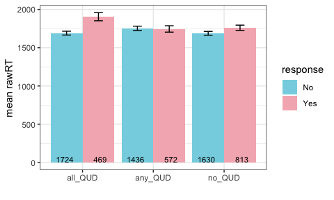
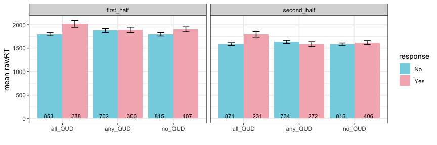

Experiment 4: summa with time pressure
================

### Before Exclusions

**Number of participants tested:**

    ## [1] 1200

**Participants in each condition:**

    ## 
    ## all_QUD any_QUD  no_QUD 
    ##     400     400     400

### Exclusions

**Non-unique participants (remove all attempts):**

    ## integer(0)

**Participants whose native language is not english:**

    ##    workerid  language
    ## 1        17        29
    ## 2        37 Cantonese
    ## 3        82 Hungarian
    ## 4        84          
    ## 5       119   swahili
    ## 6       151   Spanish
    ## 7       220   Chinese
    ## 8       245   Spanish
    ## 9       390      Urdu
    ## 10      402  Filipino
    ## 11      420          
    ## 12      430   Spanish
    ## 13      461   Russian
    ## 14      494   finnish
    ## 15      505   spanish
    ## 16      546          
    ## 17      581   Spanish
    ## 18      590          
    ## 19      602          
    ## 20      672  Mandarin
    ## 21      691          
    ## 22      695  romanian
    ## 23      715          
    ## 24      776   Spansih
    ## 25      780   tagalog
    ## 26      793    Polish
    ## 27      860 bachelors
    ## 28      870    German
    ## 29      910          
    ## 30      911          
    ## 31      924   Spanish
    ## 32      971          
    ## 33     1086   chinese
    ## 34     1160          
    ## 35     1180          
    ## 36     1182    Arabic
    ## 37     1187

**Participants who got at least two practice trials wrong:**

    ## 
    ##   2   3   4 
    ## 153  58  35

**Participants who got the audio check wrong more than one once:**

    ## 
    ## 601 696 
    ##   1   1

**Participants who got the second comprehension question wrong more than twice:**

    ## # A tibble: 12 x 2
    ## # Groups:   workerid [12]
    ##    workerid     n
    ##       <int> <int>
    ##  1       59     3
    ##  2      155     2
    ##  3      185     4
    ##  4      213     3
    ##  5      368     2
    ##  6      604     3
    ##  7      659     3
    ##  8      668     3
    ##  9      692     2
    ## 10      714     3
    ## 11      741     3
    ## 12      755     4

**Participants with accuracy of lower than 85% on non-critical trials:**

    ## # A tibble: 141 x 4
    ## # Groups:   workerid, gaveRightAnswer [141]
    ##    workerid gaveRightAnswer     n accuracy
    ##       <int> <chr>           <int>    <dbl>
    ##  1       19 1                  27    42.2 
    ##  2       24 1                  49    76.6 
    ##  3       31 1                  44    68.8 
    ##  4       51 1                  28    43.8 
    ##  5       71 1                  54    84.4 
    ##  6       73 1                   4     6.25
    ##  7       77 1                  45    70.3 
    ##  8       83 1                  54    84.4 
    ##  9       88 1                  31    48.4 
    ## 10       95 1                  48    75   
    ## # … with 131 more rows

#### Additional Exclusions

**Participants who gave more than 5 very slow (logRT&gt;20) responses:**

    ## # A tibble: 0 x 3
    ## # Groups:   workerid [0]
    ## # … with 3 variables: workerid <int>, slowResponse <lgl>, n <int>

**Responses that are faster than the onset of the quantifier (rawRT&lt;600):**

    ## [1] 154

**Responses that are very slow (logRT&gt;20):**

    ## [1] 23

After Exclusions
----------------

**Number of participants:**

    ## [1] 762

**Participants left in each condition:**

    ## 
    ## all_QUD any_QUD  no_QUD 
    ##     245     235     282

General
-------

**Expected number of yes and no answers:**

    ## 
    ##    No   Yes 
    ## 27993 29799

**Accuracy**

**Accuracy and trial order**

**Distribution of RT and logRT**

    ## Warning: Removed 2 rows containing missing values (geom_bar).

 15 fastest responses (raw RT)

    ##  [1] 645 679 688 693 699 700 700 700 700 703 707 708 709 712 718

15 slowest responses (raw RT)

    ##  [1] 4026 4026 4027 4028 4028 4029 4031 4031 4031 4032 4034 4042 4045 4047
    ## [15] 4137

### Non-critical Trials

**Response type:**

**Response time:**

### Critical Trials

**Total number of critical trials (8 per participant):**

    ## [1] 6075

\#\#\#Critical Trials **Total number of critical trials with late responses removed(8 per participant):**

    ## [1] 5991

#### Response Type

**Distribution of participants over number of semantic responses**

    ##          
    ##             0   1   2   3   4   5   6   7   8
    ##   all_QUD 144  34   7   7  11   5   6  11  19
    ##   any_QUD 123  31  12   7   3   4   6  13  36
    ##   no_QUD  139  29  11   9   5   2   9  29  47

**Response type and trial order**

**Age distribution of participants**

    ## Warning: Removed 4 rows containing non-finite values (stat_bin).

**Response type and age**

#### Response Time

**Distribution of response times in critical trials**

    ## Warning: Removed 2 rows containing missing values (geom_bar).

**Response time and QUD**

**Response time, trial order and QUD**

**Response time, responder type and QUD**

**Response time, age and QUD**

**Response time, age, responder type and QUD**

